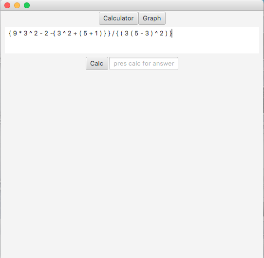
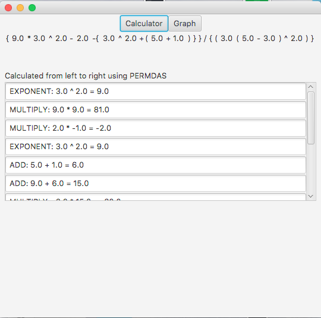
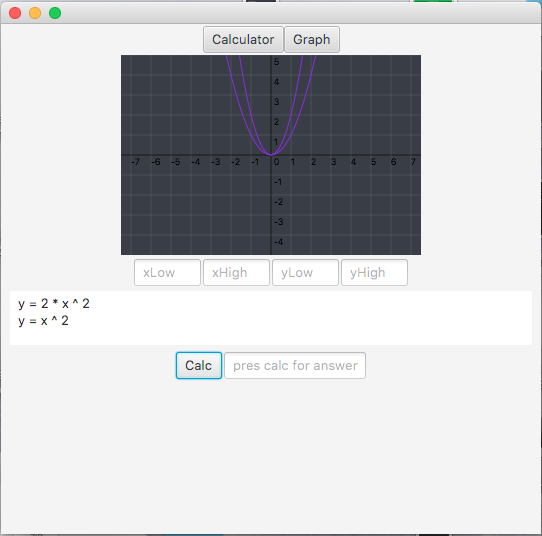

# JavaFX8-Dijkstra-and-Graph-Calculator

- This calculator is a simplified version from a recent project. It provides feedback to the user to help them with understanding where they've made errors in hand calculations of polynomials. After the polynomial is entered into the "problem" text-field, the user then enters the correct answer into the "answer" text-field. If the user has entered an incorrect answer, a drop-down list is displayed with the operators and coefficients in the order they were calculated in. The user can hover over the drop-down list and the operator in the original polynomail will be highlighted with a circle displayed above the operator. The user may then check their calculations for common errors such as calculations with the operator sequence or failing to change/carry the signs.  

Click the image below for a demo on youtube. You will have to return to this page when the video is finished.

 

- This calculator uses Edgsar Dijkstra's Shunting Yard algorithm to ensure correct 
order of operations. 
- After entering the expression in the main field of the calculator, and pressing calc: 
  - The answer will show in the answer field.
  - The operations will be displayed in the order that they were calculated in a scrollpane below the answer. If the user
  hovers a mouse over the textfields, a circle will appear over the operator in the original expression. 
  - The dijkstra-parser does not expect variables such as "x" or "y". Variables should be handled by the using class. An
  example of how variables are handled are provided by the graphing calculator.
  
  Currently the parser is looking for whitespace to seperate numbers from expressions and paranthesis. Large polynomials need
  to be divided by paranthesis. The expression:
  
  9 * 3^2 - 2 -( 3^2 + (5 + 1) / 3(5 - 3)^2
  
  should be written as: 
  
  { 9 * 3 ^ 2 - 2 -{ 3 ^ 2 + ( 5 + 1 ) } } / ( 3 ( 5 - 3 ) ^ 2 )
  
  The parser can be modified so that the user does not have to insert whitespace between coeficients and operators. However there is a performance hit for those operations. Admitadly the performance hit might not be significant if implemented correctly and would make the polynomial easier to write. 

The Graphing Calculator uses the Dijkstra-Parser to calculate the graphs. Multiple graphs may be drawn simultainiously
  by using a new line to seperate each graph. "y = " is expected before each polynomial. 
  
  for example:
  
  y = x ^ 2
  
  y = 2 * x ^ 2 - 3
  
  The calculator performs many operations but not all. 
  
  examples:
  
  base log exp  : 10 log 4  returns 0.602059991327962
  
  sqrt root     : sqrt 4    returns 2
  
  n root x      : 3 root 1728  returns 12
  
  absolute value: | 5 - 6 |  returns 1
  
  
  - Aditional operations can be added to the operator class. To add an operator:
  
  1. Add the operator as an enum in the Operator class.
  
  The enum is self explanatory.
  
  
  As standard convention, the name of the operator is in all caps. The parameters are: String name, and int priority. 
  The majority of operators will be a 3. 
  
    LOG ("log", 3) {

          // for small roots log1p is closer to truth but using log().

          @Override
          public double execute(ExpNode expNode, double base, double exponent) {

              double result;
              result = Math.log(exponent) / Math.log(base);
              
              // For display to user
              expNode.setExpSolved("LOG: " + this.getSymbol() + " base " + base + " log exp: " + exponent + " = " + result);
              ansComponents.offer(expNode);

              return result;
          }
      }, ...
    
      // If it is a Unary operator override the isUnaryOperator method and set it to true.
      
        @Override
          public boolean isUnaryOp() {
              return true;
          }
    
    
    
   2. Also, add the new operator to the switch in the DijkstraParser.getOperator() method
   
   
   
   
   LICENSE & COPYRIGHT:
   
   This project is Copyrighted by it's author Lowell Stadelman.
   It is unrestricted, and free to use distribute and modify as needed under the condition that this copyright is included in the header of the file. 
